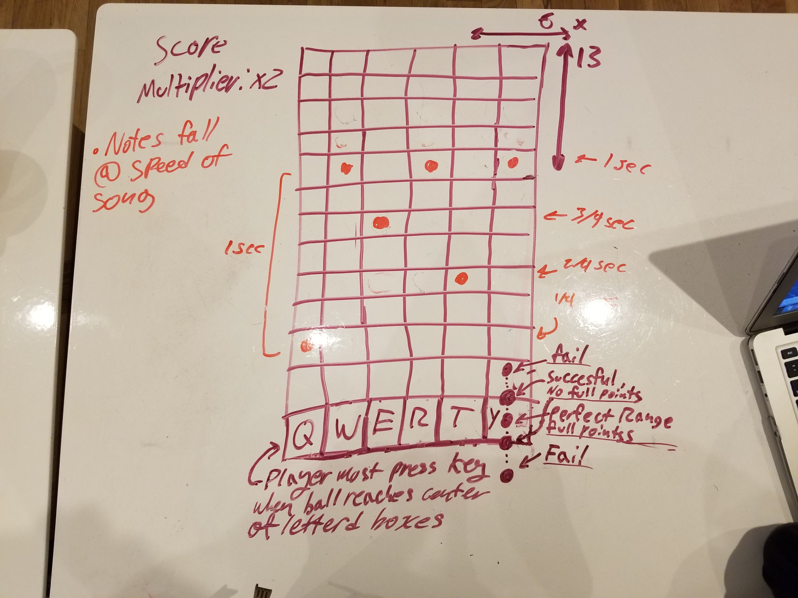

# GuitarZero
Have you ever been listening to your favorite Rock song, played air-guitar, and said
to yourself "Damn, I wish could play that guitar solo!"? Have you ever started playing guitar
and quit after realizing the amount of effort it actually takes to play these tunes?
Well now with GuitarZero you can play some of your favorite tracks without the hassle
of actually learning the guitar, WOW!

Pick a song. Use your keyboard to hit the incoming notes on beat, get a high score, and feel like
a rockstar!

## MVP
1. The game starts a 13*6(6 columns, 13 rows) grid is generated. and a series of
   randomized notes began to fall on any of the 6 columns

3. each column has key associated to it, From left to right those keys are Q, W , E, R, T, Y

4. As the notes are falling down the column the player must press the columns associated
   key when the note reaches the very end of the grid(the 13 row).

5. As you correctly hit the key when the notes reach the bottom you get points.
   If the player fails the hit the note correctly he will not receive any points.

6. If the player fails to hit the notes 10 times in a row he will lose the game
   and must restart.

7. The game ends when all the notes have fallen and the song ends

## Post-MVP specs

1. There will be a start menu, and you may choose a song out of 3 to play.
   You must complete the song before it to unlock the next song.

2. when the game starts the grid will be generated and a series of predetermined,
   the song will play and notes will began to fall down the grid. These notes will will fall at the speed of the song that is currently playing.

3. There will be a range in which the player can successfully hit the notes.
   If they are slightly off will only receive half the amount of points then usual.

4. There are notes that have to be held, for a certain amount of time, in order
   to gain full points.

4. There is a score multiplier. If the player, perfectly hits three notes consecutively
   they will receive a multiplier, the player can have up to 5. For every multiplier,
   any points received will be multiplied by that amount. If the player fails to hit
   the notes perfectly their multiplier will be reset to 1.

5. There will be a menu at the end of the game, whether the player wins or loses, with options of
   picking a new song or trying again.

### Tech

 This game was built using basic HTML, CSS, and Javascript

### problems foreseen

1. How to have a series of divs fall at random/specific times through
    a random/specific column.
2. How can I get the game to accurately detect when the div is at a range
   so that when the key is pressed it would register as off-range, slightly
   within the perfect range, and perfectly within the perfect range

### Ideas to solve these issues
1. divs(notes) generated will receive two random numbers. the first number will be the column
   in which the div will fall through, the second number will be at what point in time
   will this div be generated.

2. I believe I may have to set coordinates along with conditionals that checks whether
   a note was in range when a key is pressed down

 
